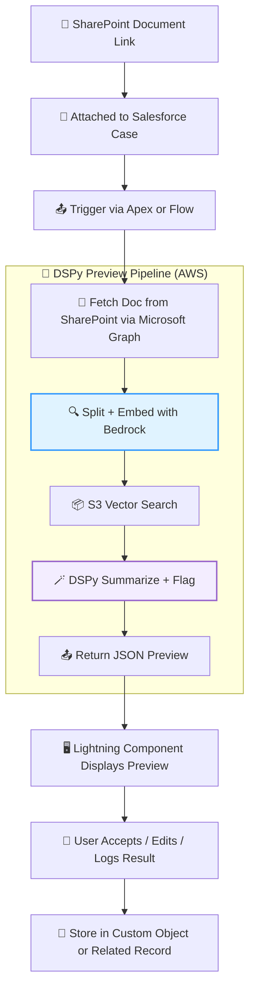

## 📄 1. **Salesforce MVP Integration Spec (1-pager)**

**Title:** *Documentation Preview Agent: Salesforce Add-On MVP*

---

### ✅ **Purpose**

Enable risk/compliance reviewers in Salesforce to preview documents (from SharePoint), auto-generate summaries, detect missing required sections/flags, and log results — all within the Salesforce UI.

---

### 🧩 **Core Components**

| Component                 | Description                                                                                    |
| ------------------------- | ---------------------------------------------------------------------------------------------- |
| 📁 **Document Source**    | Microsoft SharePoint; files linked from Salesforce Case or Risk object                         |
| 🧠 **LLM & Reasoning**    | Amazon Bedrock (Titan or Claude) + DSPy (hosted in Lambda or ECS)                              |
| 📦 **Vector Store**       | Amazon S3 Vector Search; stores embedded document chunks                                       |
| 🧾 **Metadata/Standards** | Stored as Salesforce object fields or reference lists (e.g. required sections per doc type)    |
| 🖥️ **UI**                | Lightning Component embedded in Case/Risk record page                                          |
| 🔁 **Feedback Loop**      | Edited previews logged as related record or custom object; S3 optional for versioned archiving |

---

### 🔄 **MVP Flow**

1. 📎 **User uploads or links a doc** to a Salesforce record (Case, Risk Object, etc.)
2. 📄 **Apex trigger or Flow sends metadata** + SharePoint link to external API (Lambda)
3. 🧠 **External pipeline pulls file**, embeds it, performs S3 Vector Search, and runs DSPy preview module
4. 🪄 **LLM returns structured JSON**: summary, issues, missing fields
5. 💬 **Lightning Component displays preview**
6. 📝 **User can confirm/edit preview** → log stored in related object + S3 (optional)

---

### 🔐 **Roles & Permissions**

| Role     | Access                         |
| -------- | ------------------------------ |
| Reviewer | View/edit preview              |
| Manager  | Approve/edit logs              |
| Admin    | Configure doc types, standards |

---

### 📦 **Example Output (Preview JSON)**

```json
{
  "summary": "This model development plan lacks a performance monitoring section...",
  "issues_detected": ["Missing Risk Tier", "Outdated Reference to SR 11-7"],
  "compliance_score": 67
}
```

---

### 🚧 **MVP Constraints**

* No real-time SharePoint browsing (fetch via link only)
* External preview pipeline hosted in AWS, not in Salesforce
* Preview edits stored as text field or related log object

---

## 📊 2. **Mermaid Diagram — Salesforce-Scoped Integration**



