Here's a **Version 2 architecture** that addresses key v1 pain points with better modularity, security, and user experience, while still keeping feasibility for our team.

---

## ✅ Documentation Preview Agent – **Version 2 Architecture**

This version improves:

* 🔐 **Data governance**: No raw doc transfer between clouds
* 📊 **Model grounding**: Structured expectations per doc type
* 🧠 **LLM quality**: More consistent DSPy outputs
* 🧵 **Salesforce UX**: Responsive, retry-aware workflow

---

### 🔄 **Updated V2 Flow Overview**

```mermaid
flowchart TD
    A1[📎 User Links Doc in Salesforce] --> A2[📁 Metadata: Doc Type, Risk Tier, Status]

    subgraph "🧠 DSPy Pipeline (AWS)"
        B1[🔁 SharePoint Connector Fetches DOC]
        B2[📄 Split + Embed with Titan/Claude]
        B3[📦 Store/Query in S3 Vector Index]
        B4[🧠 DSPy w/ Signature: Generate Preview + Flags]
        B5[📝 Score vs. Ground Truth from Standards JSON]
        B6[📤 Return Structured Output + Compliance Score]
    end

    A2 --> B1
    B6 --> A3[🖥️ Lightning Web Component Displays Results]
    A3 --> A4[🔁 Reviewer Accepts / Edits / Logs]
    A4 --> A5[📁 Store Versioned Feedback in Salesforce + S3]
```



---

### 🆕 **What’s Improved in Version 2**

| Area                     | V1 Issue                        | V2 Solution                                                                                                      |
| ------------------------ | ------------------------------- | ---------------------------------------------------------------------------------------------------------------- |
| 📦 **Vector Indexing**   | Embeds lack doc context/version | Now includes: `doc_type`, `expected_sections`, `version_id`, `source_link` as metadata fields in S3 Vector Index |
| 🔍 **Flagging Logic**    | Based on heuristics             | Uses **structured standards per doc type** (JSON stored in S3 or Salesforce custom object)                       |
| 🧠 **DSPy Behavior**     | Prompt drift                    | Uses DSPy `Signature` trained per doc type (e.g. Risk Memo vs Validation Plan), plus a validation `Optimizer`    |
| ⛓️ **SharePoint Access** | On-demand fetch fragile         | Implements a **doc fetcher service with retry + caching**, scoped to signed URLs or staging                      |
| 🔒 **Security / Audit**  | No traceability                 | All outputs versioned; logs include `user_id`, `model_version`, `score`, and editable fields                     |
| 🖥️ **Salesforce UI**    | Static preview only             | Lightning Web Component supports:                                                                                |
| → real-time load status  |                                 |                                                                                                                  |
| → approve/edit           |                                 |                                                                                                                  |
| → rerun preview          |                                 |                                                                                                                  |
| → view previous versions |                                 |                                                                                                                  |

---

### 🧱 Core Components in V2

| Component                     | Description                                                                        |
| ----------------------------- | ---------------------------------------------------------------------------------- |
| **DSPy Signature Set**        | One per doc type (e.g. Risk Model Plan, Validation Memo, etc.)                     |
| **Standards Ground Truth**    | JSON or Salesforce metadata (e.g. required sections, citations, authorship checks) |
| **Reviewer Feedback Store**   | Custom object in Salesforce linked to Case or Document                             |
| **S3 Vector Metadata Schema** | Stores: doc hash, doc type, chunk id, version, expected sections, flags triggered  |
| **Preview Log**               | Versioned per document and model version; human-edited copy optional               |

---

### ⚙️ Sample Output Schema (V2)

```json
{
  "doc_id": "abc123",
  "doc_type": "Model Risk Plan",
  "preview_summary": "...",
  "compliance_score": 76,
  "missing_sections": ["Model Validation Strategy", "Change Log"],
  "flagged_issues": [
    { "page": 2, "type": "Risk Tier Not Stated", "severity": "High" }
  ],
  "model_version": "titan-v2_dspy_opt1",
  "reviewer_edits": "",
  "timestamp": "2025-07-23T14:32Z"
}
```

---

## 🪜 Suggested V2 Roadmap

| Phase       | Description                                                             |
| ----------- | ----------------------------------------------------------------------- |
| **Phase 1** | Migrate DSPy logic to use doc-type-based signatures + optimizer         |
| **Phase 2** | Create document standards registry (JSON or Salesforce custom metadata) |
| **Phase 3** | Enhance Salesforce UI with LWC for preview interaction                  |
| **Phase 4** | Add logging/versioning + rerun option in the preview                    |
| **Phase 5** | Implement retry-aware SharePoint fetcher with token caching             |

---

