## 📄 1. **Standalone Preview Agent Integration Spec (Box + S3) – 1-Pager**

**Title:** *Documentation Preview Agent: Standalone MVP with Box + Bedrock + S3 Integration*

---

### ✅ **Purpose**

Enable risk and compliance reviewers to securely preview documents stored in **Box**, auto-generate summaries, detect missing sections or compliance flags, and store versioned results — all through a **self-contained web app** (e.g., Streamlit or Flask+React), without relying on Salesforce or CRM plugins.

---

### 🧩 **Core Components**

| Component                 | Description                                                                                 |
| ------------------------- | ------------------------------------------------------------------------------------------- |
| 📁 **Document Source**    | **Box** file picker or webhook; files linked or uploaded to Box workspace                   |
| 🧠 **LLM & Reasoning**    | Amazon Bedrock (Titan or Claude) + DSPy (deployed via Lambda, ECS, or internal API)         |
| 📦 **Vector Store**       | Amazon **S3 Vector Search**; stores embedded document chunks + metadata                     |
| 🧾 **Metadata/Standards** | JSON-based rulesets stored in S3 or NoSQL DB (e.g., required sections by doc type)          |
| 🖥️ **UI**                | Standalone Web App (Streamlit, Flask+React, or lightweight internal tool)                   |
| 🔁 **Feedback Loop**      | All previews + human edits logged as versioned records in **S3** and/or relational database |

---

### 🔄 **MVP Flow**

1. 📎 **User selects or uploads a doc** via Box interface (link or direct selection)
2. 📄 **Webhook or manual trigger** sends Box `file_id` and metadata to the pipeline
3. 🧠 **Pipeline fetches file from Box**, parses it, embeds chunks, indexes in S3, runs DSPy with standards
4. 🪄 **LLM returns structured preview**: summary, flags, missing sections, and score
5. 💬 **Web UI displays preview + edit pane**
6. 📝 **User confirms/edits preview** → result saved to S3 (JSON) with reviewer, version, score, and flag metadata

---

### 🔐 **Roles & Permissions**

| Role     | Access                              |
| -------- | ----------------------------------- |
| Reviewer | View/edit/approve preview           |
| Admin    | Manage standards and rerun logic    |
| System   | Scoped access to Box and S3 buckets |

---

### 📦 **Example Output (Preview JSON)**

```json
{
  "summary": "This model development plan lacks a performance monitoring section...",
  "issues_detected": ["Missing Risk Tier", "Outdated Reference to SR 11-7"],
  "compliance_score": 67,
  "box_file_id": "12345",
  "model_version": "titan-v2.0-sig3",
  "reviewer": "analyst_01",
  "timestamp": "2025-07-23T17:22Z"
}
```

---

### 🚧 **MVP Constraints**

* No Salesforce integration or CRM dependencies
* All logs stored in cloud-native services (S3, RDS, DynamoDB)
* Standards and scoring logic are JSON-defined, not schema-driven
* Preview re-run requires manual trigger or webhook from Box

---

## 📊 2. **Mermaid Diagram — Box + S3 + DSPy Standalone Integration**

```mermaid
flowchart TD
    %% === USER INTERACTION ===
    A1[📁 User Selects or Uploads Box File] --> A2[🔗 File ID Sent via Webhook or UI Trigger]

    %% === PIPELINE ===
    subgraph "🧠 DSPy Preview Pipeline (AWS)"
        B1[🔁 Fetch Doc from Box API via App Token]
        B1 --> B2[🧩 Parse + Embed with Bedrock]
        B2 --> B3[📦 Store Embeddings in S3 Vector Index]
        B3 --> B4[🔍 Search + Retrieve Relevant Chunks]
        B4 --> B5[🪄 DSPy Summarize + Flag + Score]
        B5 --> B6[📤 Return JSON Preview]
    end

    %% === DISPLAY + LOGGING ===
    B6 --> C1[🖥️ Standalone Web UI Displays Preview]
    C1 --> C2[📝 User Edits/Confirms Summary]
    C2 --> C3[📁 Save to S3 + Optional Database]

    style B2 fill:#e0f3ff,stroke:#3399ff,stroke-width:2px
    style B5 fill:#f3edff,stroke:#9966cc,stroke-width:2px
```


