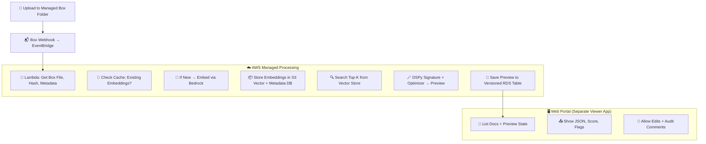

# 🌐 **Managed Pipeline Pattern**

*A cloud-native, low-friction redesign that offloads complexity to managed services and simplifies orchestration.*

---

## ✅ Goals of This Redesign

| Target                              | Strategy                                                |
| ----------------------------------- | ------------------------------------------------------- |
| 🔐 Reduce **auth friction**         | Remove token juggling (Box, S3, IAM complexity)         |
| 🧠 Simplify **DSPy/LLM workflow**   | Consolidate LLM and vector search logic                 |
| 🗂 Reduce **indexing overhead**     | Avoid re-embedding by storing canonical hashes          |
| 🧾 Improve **logging + versioning** | Store previews in versioned DB with rollback            |
| 🖥 Reduce **UX friction**           | Decouple viewer from processor; allow polling + retries |
| 📉 Lower **costs + idle compute**   | Use event-driven, serverless infra                      |

---

## 🧭 Architecture Summary: Managed Pipeline Pattern

---

## ✅ 25 Pain Points: How They're Reduced in This Design

| Pain Area                  | Previous Pain                    | Managed Pattern Fix                                                    |
| -------------------------- | -------------------------------- | ---------------------------------------------------------------------- |
| 🔐 Box Auth                | Token juggling, link expiry      | App Token + folder-scoped webhook triggers → no direct file links      |
| 🗂 Box fetch               | File not ready at trigger time   | Use **event delay queue or precheck** in Lambda                        |
| 📦 Embedding               | Re-runs without change detection | **Hash files** before embedding; cache by `doc_id+hash+version`        |
| 💰 Cost                    | Re-embedding unchanged docs      | **Embedding cache layer** avoids duplicate Bedrock calls               |
| ⚠️ Vector store complexity | Manual index mgmt                | S3 Vector + Metadata DB auto-managed by Lambda                         |
| 🧠 DSPy Signature drift    | No version tracking              | Signature ID + version stored in metadata DB                           |
| 🔁 Retry logic             | Silent failures                  | Lambda retries, or retry flags stored in DB with TTL watchdog          |
| 📝 Logging                 | Manual, unversioned              | Preview + edits stored in **Postgres or DynamoDB**, versioned by run # |
| 🧵 UI tied to logic        | Fragile coupling                 | Processing and UI are **fully decoupled**                              |
| 📤 Preview display         | Blocking / slow UX               | Poll or subscribe to preview status in web UI                          |
| 📎 Reviewer edits          | Not tracked clearly              | All edits stored as **diffs in DB**, versioned per doc                 |
| 🧠 Prompt coverage         | No confidence levels             | DSPy output includes **section match confidence**, visible in UI       |
| 🔍 Flag drift              | Flags vary by doc type           | Ruleset stored as JSON in DB and attached to each preview run          |
| 📦 Box webhook spam        | Race condition                   | Use **idempotent dedup key** in queue or DB lock                       |
| 🚫 No rollback             | Reviewers overwrite output       | DB stores all previews as **immutable versions**, with rollback option |
| 🌐 Hosting                 | Monolithic                       | Stateless Lambda + separate Streamlit or React frontend                |
| 🕒 Latency complaints      | No spinner                       | Frontend fetches from queue or API with progress bar                   |
| 🔄 File updates            | Requires re-embedding            | Hash-based check detects true changes                                  |
| ⚙️ Deployment              | Manual components                | Fully deployable via **CDK / Terraform** as serverless stack           |
| 🔧 DSPy tuning             | Black box                        | Expose **Signature version + sample prompt** per run in log            |
| 🔒 Vector ACL              | Lacked control                   | Embed metadata includes project/user, used in filtering                |
| 📥 Invalid files           | OCR not applied                  | Precheck for OCR/parse errors → route to fallback queue                |
| 📈 Observability           | No job status                    | All runs tagged with job ID, status, retry state, timestamps           |
| 🧾 Compliance tracking     | Manual                           | Each preview stamped with reviewer ID, doc version, model version      |
| 🚨 Error visibility        | Buried logs                      | Errors shown in web UI status feed or email alert (SNS/SES)            |

---

## 🧩 Summary

| Feature                              | Benefit                              |
| ------------------------------------ | ------------------------------------ |
| **Webhook-triggered pipeline**       | Reduces auth, avoids polling         |
| **Serverless jobs**                  | Scales cleanly, cost-effective       |
| **DB-backed versioning**             | Enables rollback, audit traceability |
| **Cached embedding & preview logic** | Avoids duplication, saves money      |
| **Separate viewer**                  | Streamlined UX with status awareness |

