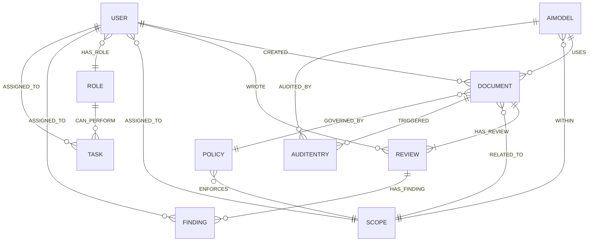

```mermaid
erDiagram
  USER ||--o{ DOCUMENT : "CREATED"
  USER ||--o{ REVIEW : "WROTE"
  DOCUMENT ||--|{ REVIEW : "HAS_REVIEW"
  DOCUMENT }o--|| SCOPE : "RELATED_TO"
  DOCUMENT ||--o{ AUDITENTRY : "TRIGGERED"
  DOCUMENT }o--|| POLICY : "GOVERNED_BY"

  AIMODEL ||--o{ DOCUMENT : "USES"
  AIMODEL }o--|| SCOPE : "WITHIN"
  AIMODEL ||--o{ AUDITENTRY : "AUDITED_BY"

  POLICY }o--|| SCOPE : "ENFORCES"
  USER }o--|| SCOPE : "ASSIGNED_TO"

  REVIEW ||--o{ FINDING : "HAS_FINDING"
  FINDING }o--|| USER : "ASSIGNED_TO"

  USER }o--|| ROLE : "HAS_ROLE"
  ROLE ||--o{ TASK : "CAN_PERFORM"
  TASK }o--|| USER : "ASSIGNED_TO"
```
