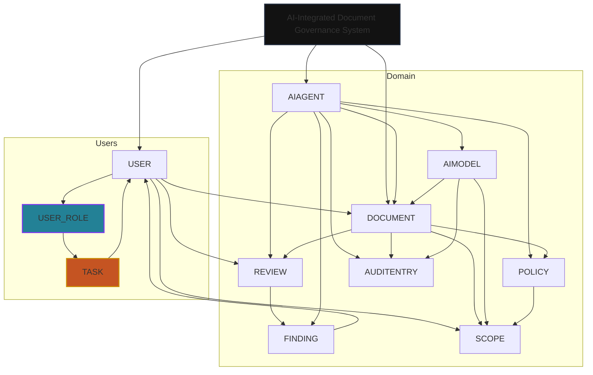

```mermaid
graph TD

  %% === TITLE ===
  TITLE[AI-Integrated Document Governance System]
  TITLE --> USER
  TITLE --> AIAGENT
  TITLE --> DOCUMENT

  %% === USER AREA ===
  subgraph Users
    USER[USER]
    USER_ROLE[USER_ROLE]
    USER --> USER_ROLE
    USER_ROLE --> TASK
    TASK --> USER
  end


  %% === DOMAIN AREA ===
  subgraph Domain
    DOCUMENT[DOCUMENT]
    REVIEW[REVIEW]
    FINDING[FINDING]
    SCOPE[SCOPE]
    POLICY[POLICY]
    AUDITENTRY[AUDITENTRY]
    AIMODEL[AIMODEL]

    USER --> DOCUMENT
    USER --> REVIEW
    REVIEW --> FINDING
    FINDING --> USER
    USER --> SCOPE

    AIAGENT --> REVIEW
    AIAGENT --> DOCUMENT
    AIAGENT --> FINDING
    AIAGENT --> POLICY
    AIAGENT --> AUDITENTRY
    AIAGENT --> AIMODEL

    DOCUMENT --> REVIEW
    DOCUMENT --> SCOPE
    DOCUMENT --> POLICY
    DOCUMENT --> AUDITENTRY

    AIMODEL --> DOCUMENT
    AIMODEL --> SCOPE
    AIMODEL --> AUDITENTRY
    POLICY --> SCOPE
  end

  %% === STYLE CLASSES ===
  classDef titleStyle fill:#121212,stroke:#1e293b,stroke-width:2px;
  classDef taskStyle fill:#C55422,stroke:#ca8a04,stroke-width:2px;
  classDef roleStyle fill:#238196,stroke:#7c3aed,stroke-width:2px;

  %% === APPLY STYLES ===
  class TITLE titleStyle
  class TASK taskStyle
  class USER_ROLE,AIAGENT_ROLE roleStyle
```
