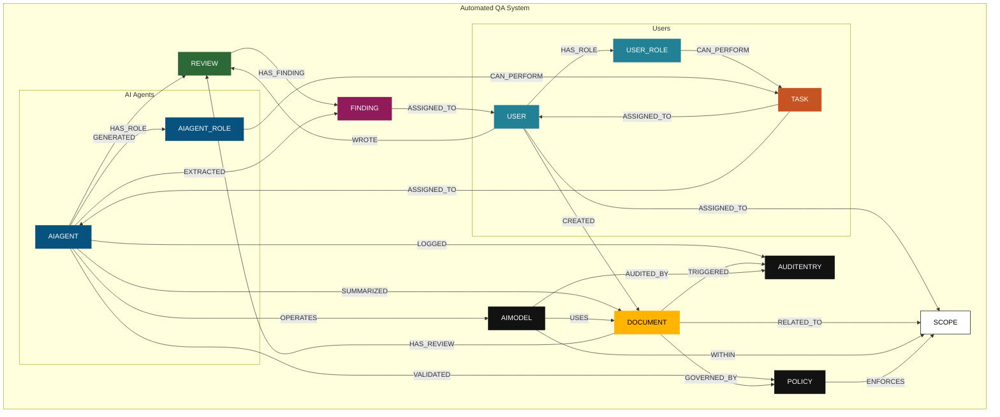

```mermaid
graph TD


  %% === DOMAIN AREA ===
  subgraph Automated QA System
    DOCUMENT[DOCUMENT]
    REVIEW[REVIEW]
    FINDING[FINDING]
    SCOPE[SCOPE]
    POLICY[POLICY]
    AUDITENTRY[AUDITENTRY]
    AIMODEL[AIMODEL]

    USER -->|CREATED| DOCUMENT
    USER -->|WROTE| REVIEW
    REVIEW -->|HAS_FINDING| FINDING
    FINDING -->|ASSIGNED_TO| USER
    USER -->|ASSIGNED_TO| SCOPE

    AIAGENT -->|GENERATED| REVIEW
    AIAGENT -->|SUMMARIZED| DOCUMENT
    AIAGENT -->|EXTRACTED| FINDING
    AIAGENT -->|VALIDATED| POLICY
    AIAGENT -->|LOGGED| AUDITENTRY
    AIAGENT -->|OPERATES| AIMODEL

    DOCUMENT -->|HAS_REVIEW| REVIEW
    DOCUMENT -->|RELATED_TO| SCOPE
    DOCUMENT -->|GOVERNED_BY| POLICY
    DOCUMENT -->|TRIGGERED| AUDITENTRY

    AIMODEL -->|USES| DOCUMENT
    AIMODEL -->|WITHIN| SCOPE
    AIMODEL -->|AUDITED_BY| AUDITENTRY

    POLICY -->|ENFORCES| SCOPE

%% === USER AREA ===
  subgraph Users
    USER[USER]
    USER_ROLE[USER_ROLE]
    USER -->|HAS_ROLE| USER_ROLE
    USER_ROLE -->|CAN_PERFORM| TASK
    TASK -->|ASSIGNED_TO| USER
  end

  %% === AI AGENT AREA ===
  subgraph AI Agents
    AIAGENT[AIAGENT]
    AIAGENT_ROLE[AIAGENT_ROLE]
    AIAGENT -->|HAS_ROLE| AIAGENT_ROLE
    AIAGENT_ROLE -->|CAN_PERFORM| TASK
    TASK -->|ASSIGNED_TO| AIAGENT
  end
  end
  

%% === Corporate Palette Class Definitions ===
classDef darkGreen fill:#05341D,stroke:#05341D,color:#FFFFFF;
classDef offWhite fill:#EDEBE9,stroke:#EDEBE9,color:#000000;
classDef blue fill:#085280,stroke:#085280,color:#FFFFFF;
classDef white fill:#FFFFFF,stroke:#000000,color:#000000;
classDef darkNeutral fill:#121212,stroke:#000000,color:#FFFFFF;

classDef burntOrange fill:#C55422,stroke:#C55422,color:#FFFFFF;
classDef teal fill:#238196,stroke:#238196,color:#FFFFFF;

classDef mustardYellow fill:#FFB400,stroke:#FFB400,color:#000000;
classDef forestGreen fill:#2C6937,stroke:#2C6937,color:#FFFFFF;
classDef deepMagenta fill:#911A5B,stroke:#911A5B,color:#FFFFFF;


  %% === APPLY STYLES ===
  class USER teal
  class USER_ROLE teal
  class AIAGENT blue
  class AIAGENT_ROLE blue
  class TASK burntOrange
  class DOCUMENT mustardYellow
  class REVIEW forestGreen
  class FINDING deepMagenta
  class POLICY darkNeutral
  class SCOPE white
  class AUDITENTRY darkNeutral
  class AIMODEL darkNeutral
```
