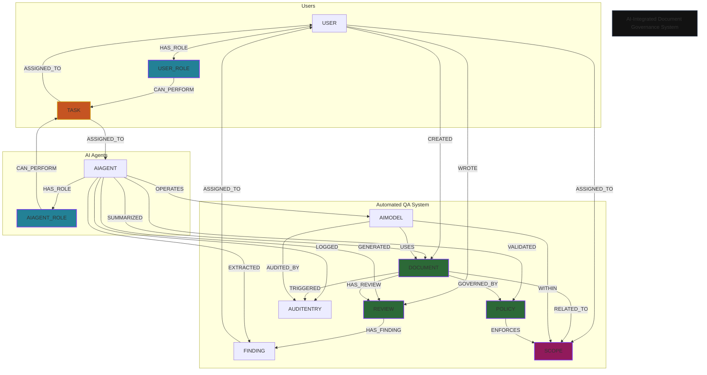

```mermaid
graph TD

  %% === TITLE ===
  TITLE[AI-Integrated Document Governance System]


  %% === USER AREA ===
  subgraph Users
    USER[USER]
    USER_ROLE[USER_ROLE]
    USER -->|HAS_ROLE| USER_ROLE
    USER_ROLE -->|CAN_PERFORM| TASK
    TASK -->|ASSIGNED_TO| USER
  end

  %% === AI AGENT AREA ===
  subgraph AI Agents
    AIAGENT[AIAGENT]
    AIAGENT_ROLE[AIAGENT_ROLE]
    AIAGENT -->|HAS_ROLE| AIAGENT_ROLE
    AIAGENT_ROLE -->|CAN_PERFORM| TASK
    TASK -->|ASSIGNED_TO| AIAGENT
  end

  %% === DOMAIN AREA ===
  subgraph Automated QA System
    DOCUMENT[DOCUMENT]
    REVIEW[REVIEW]
    FINDING[FINDING]
    SCOPE[SCOPE]
    POLICY[POLICY]
    AUDITENTRY[AUDITENTRY]
    AIMODEL[AIMODEL]

    USER -->|CREATED| DOCUMENT
    USER -->|WROTE| REVIEW
    REVIEW -->|HAS_FINDING| FINDING
    FINDING -->|ASSIGNED_TO| USER
    USER -->|ASSIGNED_TO| SCOPE

    AIAGENT -->|GENERATED| REVIEW
    AIAGENT -->|SUMMARIZED| DOCUMENT
    AIAGENT -->|EXTRACTED| FINDING
    AIAGENT -->|VALIDATED| POLICY
    AIAGENT -->|LOGGED| AUDITENTRY
    AIAGENT -->|OPERATES| AIMODEL

    DOCUMENT -->|HAS_REVIEW| REVIEW
    DOCUMENT -->|RELATED_TO| SCOPE
    DOCUMENT -->|GOVERNED_BY| POLICY
    DOCUMENT -->|TRIGGERED| AUDITENTRY

    AIMODEL -->|USES| DOCUMENT
    AIMODEL -->|WITHIN| SCOPE
    AIMODEL -->|AUDITED_BY| AUDITENTRY

    POLICY -->|ENFORCES| SCOPE
  end

  %% === STYLE CLASSES ===
  classDef titleStyle fill:#121212,stroke:#1e293b,stroke-width:2px;
  classDef taskStyle fill:#C55422,stroke:#ca8a04,stroke-width:2px;
  classDef roleStyle fill:#238196,stroke:#7c3aed,stroke-width:2px;
  classDef documentStyle fill:#FFB400,stroke:#7c3aed,stroke-width:2px;
  classDef reviewStyle fill:#2C6937,stroke:#7c3aed,stroke-width:2px;
  classDef scopeStyle fill:#911A5B,stroke:#7c3aed,stroke-width:2px;

  %% === APPLY STYLES ===
  class TITLE titleStyle
  class TASK taskStyle
  class USER_ROLE,AIAGENT_ROLE roleStyle
  class REVIEW,DOCUMENT,POLICY reviewStyle
  class SCOPE scopeStyle
```
