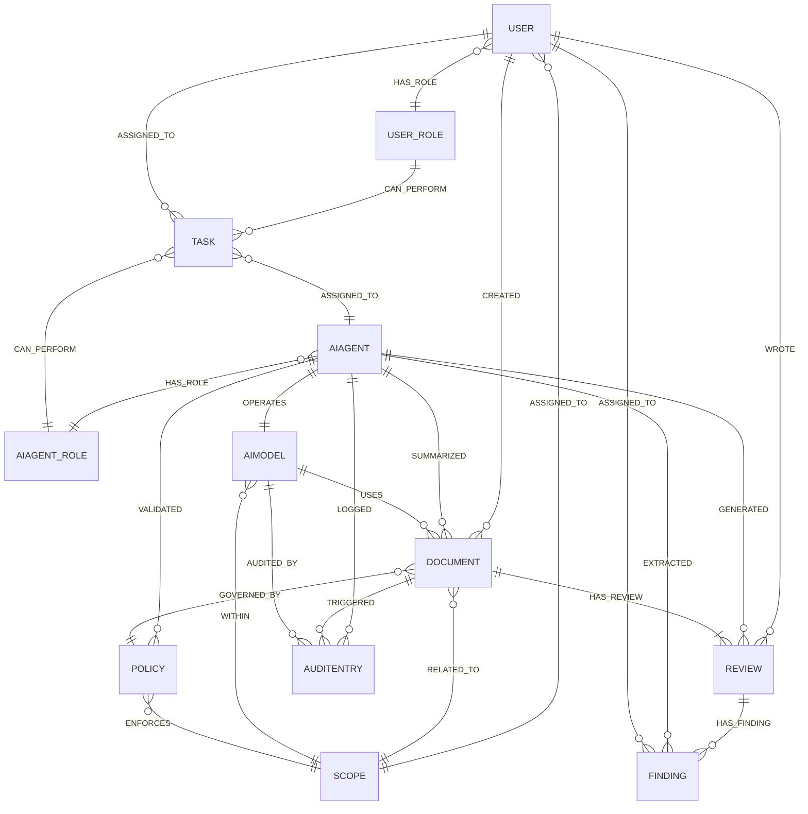
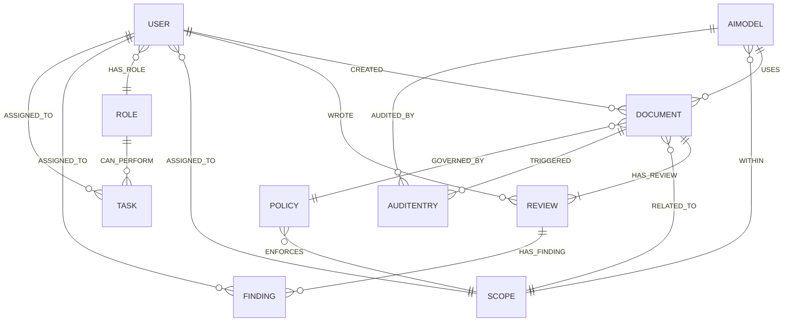

```mermaid
%% Entity Relationship Diagram: AI-Integrated Document Governance System
erDiagram
  %% === USERS + ROLES ============================
  USER }o--|| USER_ROLE : "HAS_ROLE"
  USER_ROLE ||--o{ TASK : "CAN_PERFORM"
  TASK }o--|| USER : "ASSIGNED_TO"
  USER ||--o{ DOCUMENT : "CREATED"
  USER ||--o{ REVIEW : "WROTE"
  REVIEW ||--o{ FINDING : "HAS_FINDING"
  FINDING }o--|| USER : "ASSIGNED_TO"
  USER }o--|| SCOPE : "ASSIGNED_TO"

  %% === AI AGENTS + ROLES ========================
  AIAGENT }o--|| AIAGENT_ROLE : "HAS_ROLE"
  AIAGENT_ROLE ||--o{ TASK : "CAN_PERFORM"
  TASK }o--|| AIAGENT : "ASSIGNED_TO"
  AIAGENT ||--o{ REVIEW : "GENERATED"
  AIAGENT ||--o{ DOCUMENT : "SUMMARIZED"
  AIAGENT ||--o{ FINDING : "EXTRACTED"
  AIAGENT ||--o{ POLICY : "VALIDATED"
  AIAGENT ||--o{ AUDITENTRY : "LOGGED"
  AIAGENT ||--|| AIMODEL : "OPERATES"

  %% === CORE DOMAIN ENTITIES =====================
  DOCUMENT ||--|{ REVIEW : "HAS_REVIEW"
  DOCUMENT }o--|| SCOPE : "RELATED_TO"
  DOCUMENT ||--o{ AUDITENTRY : "TRIGGERED"
  DOCUMENT }o--|| POLICY : "GOVERNED_BY"

  AIMODEL ||--o{ DOCUMENT : "USES"
  AIMODEL }o--|| SCOPE : "WITHIN"
  AIMODEL ||--o{ AUDITENTRY : "AUDITED_BY"

  POLICY }o--|| SCOPE : "ENFORCES"
```

```mermaid
erDiagram
  USER ||--o{ DOCUMENT : "CREATED"
  USER ||--o{ REVIEW : "WROTE"
  DOCUMENT ||--|{ REVIEW : "HAS_REVIEW"
  DOCUMENT }o--|| SCOPE : "RELATED_TO"
  DOCUMENT ||--o{ AUDITENTRY : "TRIGGERED"
  DOCUMENT }o--|| POLICY : "GOVERNED_BY"

  AIMODEL ||--o{ DOCUMENT : "USES"
  AIMODEL }o--|| SCOPE : "WITHIN"
  AIMODEL ||--o{ AUDITENTRY : "AUDITED_BY"

  POLICY }o--|| SCOPE : "ENFORCES"
  USER }o--|| SCOPE : "ASSIGNED_TO"

  REVIEW ||--o{ FINDING : "HAS_FINDING"
  FINDING }o--|| USER : "ASSIGNED_TO"

  USER }o--|| ROLE : "HAS_ROLE"
  ROLE ||--o{ TASK : "CAN_PERFORM"
  TASK }o--|| USER : "ASSIGNED_TO"
```
